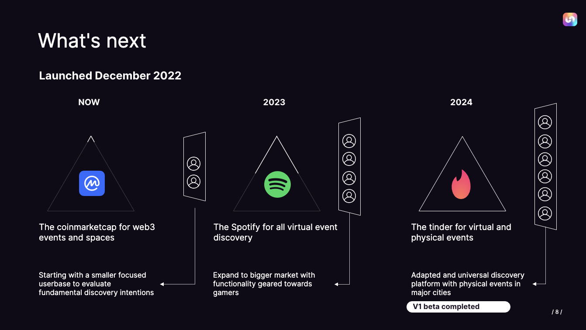

[![Contributors][contributors-shield]][contributors-url]

<h1 style="text-align:center; font-size: xxx-large">Uncoverse</h1>

  

    This project is a metaverse event discovery engine, pulling all metaverse events into one place, and making it easier to discover and create events.
     
    <a href="https://www.uncoverse.com"><strong>View the live site »</strong></a>
     
    <a href="https://github.com/ColinSprows/uncoverse"><strong>Explore the repo »</strong></a>
     
  

  
Table of Contents

  <ol>
    <li><a href="#built-with">Built With</a></li>
    <li> <a href="#about-the-project">About The Project</a></li>
    <li><a href="#walkthrough">Walkthrough</a></li>
    <li><a href="#roadmap">Roadmap</a></li>
    <li><a href="#development">Development</a></li>
    <li><a href="#installation-and-usage">Installation and Usage</a></li>
    <li><a href="#contributing">Contributing</a></li>
    <li><a href="#license">License</a></li>
    <li><a href="#contact">Contact</a></li>
    <li><a href="#acknowledgments">Acknowledgments</a></li>

  </ol>

## Built With

    

      
    

    

      
    

    

      
    

    

      
    

    

      
    

    

      
    

    

      
    

## About the Project

Uncoverse is an Event Discovery Engine for all metaverse platforms. It allows users to browse current and upcoming events across all metaverses, and filter/favorite their favorite events. It features a full suite of tools, including event discovery, metaverse data comparissons, and extensive user profiles.

## Walkthrough

The landing page has adspace and leaderboards at the top, followed by a list of all upcoming metaverse events. The user can click on the events to get more specific info and favorite events to be viewed later. The user can also jump to an event or easily share an event from the event modal.
  

The analytics allows users to compare different metaverses by DAU (daily active users), and  edit the time frame to get precise data. This is the first step in a suite of metaverse creator tools.
  

The watchlist allows users to see events they have favorited and jump directly to them. It is a great way to keep track of upcoming and past metaverse events users have attended.
  

## Roadmap

Our plan for future development has been put on hold due to the lack of DAU in the metaverse, although future plans include:

- A suite of tools for creators
- More extensive analytics
- Additions to the user profiles

## Development

Our collaborative team implemented agile methodologies in an extended planning phase, to try and enable clear opportunities for sprints and alleviate tech debt concerns as the project developed. We created an extensive roadmap, had daily standups, and developed several business tools including a deck and one sheet. Below are some screenshots of our planning documents.

  

    
    
Context and Catalysts

  

  

    
    
The Problem

  

 

    
    
The Solution

  

  

    
    
UI Overview

  

  

    
    
Market Analysis

  

  

    
    
Our Advantage

  

  

    
    
Future Plans

  

  

    
    
Roadmap

  

## Installation and Usage

To install, clone the repo and run `npm install` in the root directory.

After successfully getting setup, you can run `npm run dev` to start the development server.

## Contributing

If you'd like to contribute, please fork the repository and use a feature branch. Pull requests are welcome!

## License

Distributed under the MIT License. See `LICENSE` for more information.

## Contact

Colin Sprows:

- [LinkedIn](https://www.linkedin.com/in/colinsprows/)
- [Portfolio](https://www.colinsprows.com/)
- [Github](https://www.github.com/ColinSprows)
- [Email](mailto:colin.sprows@gmail.com)

Gareth Pembroke:

- [LinkedIn](https://www.linkedin.com/in/garethpembroke)
- [Github](https://github.com/GPembroke21)
- [Email](mailto:garethpembroke@gmail.com)

Will Coursen:

- [LinkedIn](https://www.linkedin.com/in/willcoursen)
- [Email](mailto:willcoursen@gmail.com)

## Acknowledgements

- [Img Shields](https://shields.io)

[contributors-shield]: https://img.shields.io/github/contributors/ColinSprows/fraime.svg?style=for-the-badge
[contributors-url]: https://github.com/ColinSprows/fraime/graphs/contributors
